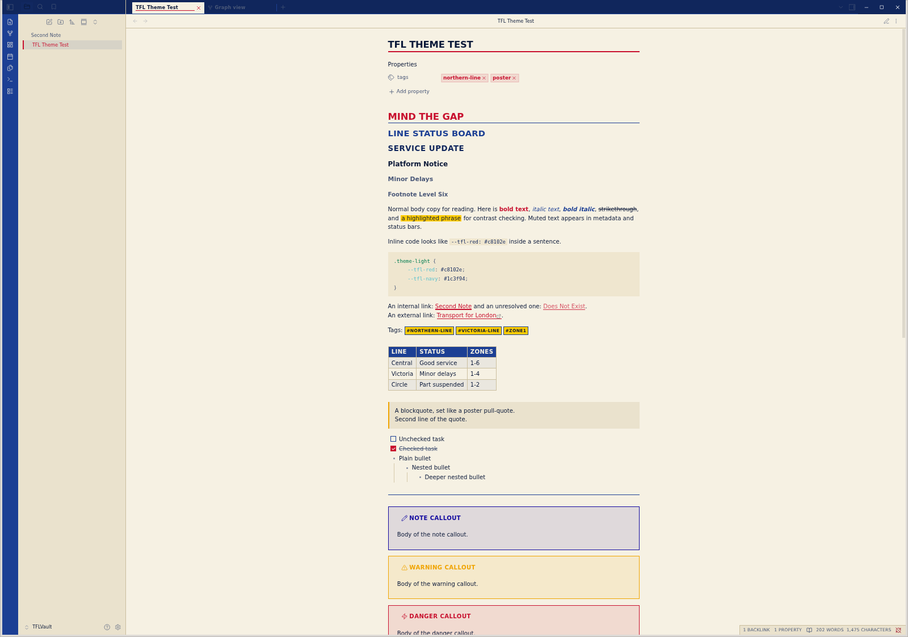
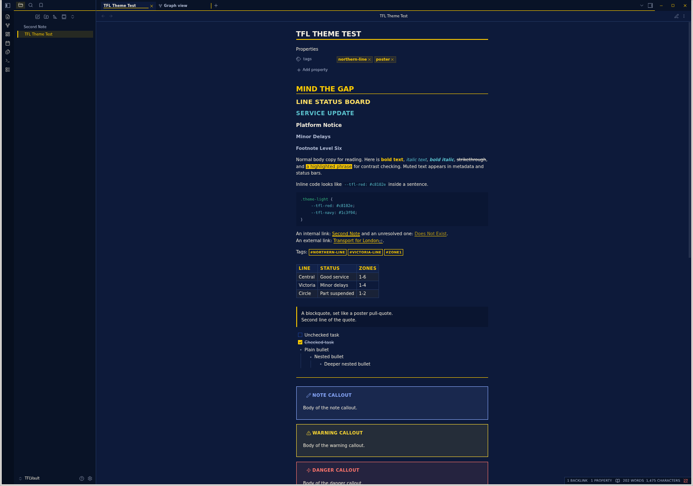

# TFL

An Obsidian theme inspired by Transport for London posters, the roundel, and
Johnston signage. It supports both light and dark mode, with a flat,
high-contrast palette built for clear reading and strong visual hierarchy.

## Palette

- Roundel red: `#c8102e`
- Poster navy: `#1c3f94`
- Signage yellow: `#ffcc00`
- Poster cream: `#f6f1e3`





These screenshots were captured in Obsidian 1.13.7.

## Installation

Once published, install **TFL** from Obsidian's community themes directory:

1. Open **Settings → Appearance → Community themes**.
2. Search for **TFL** and select **Install**.
3. Select **Use**.

For manual installation, copy `manifest.json` and `theme.css` into:

```text
<vault>/.obsidian/themes/TFL/
```

Then select **TFL** under **Settings → Appearance → Themes**.

Johnston is proprietary, so this theme uses a Gill Sans-led fallback stack
instead of bundling the typeface.

## Development

This theme is based on
[obsidian-sample-theme](https://github.com/obsidianmd/obsidian-sample-theme).

```bash
npm install
npm run lint
```
